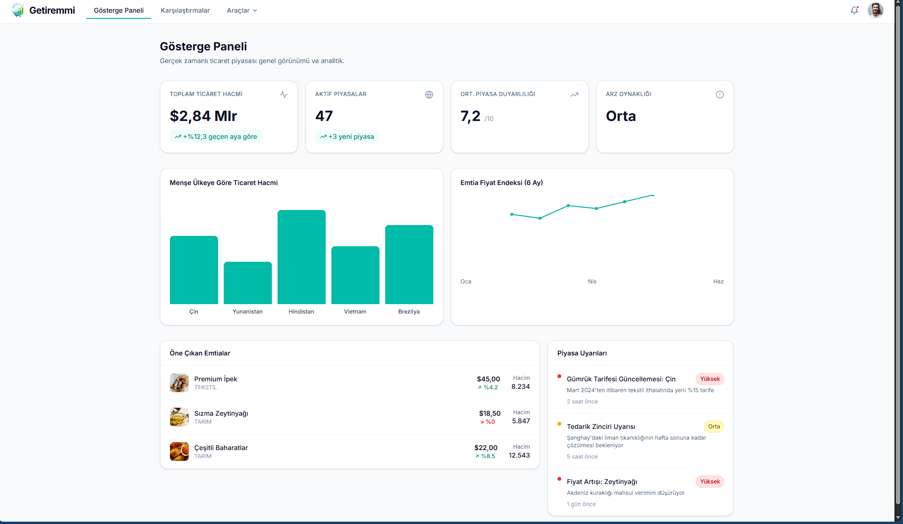
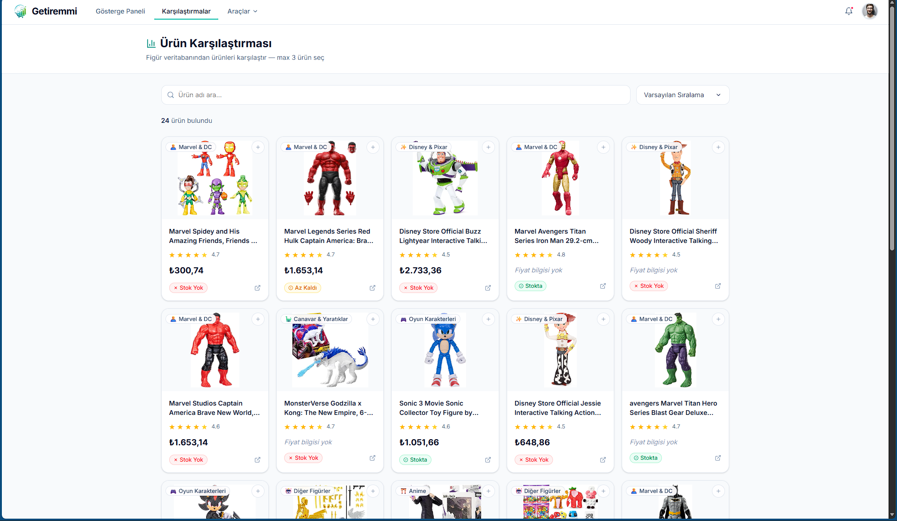
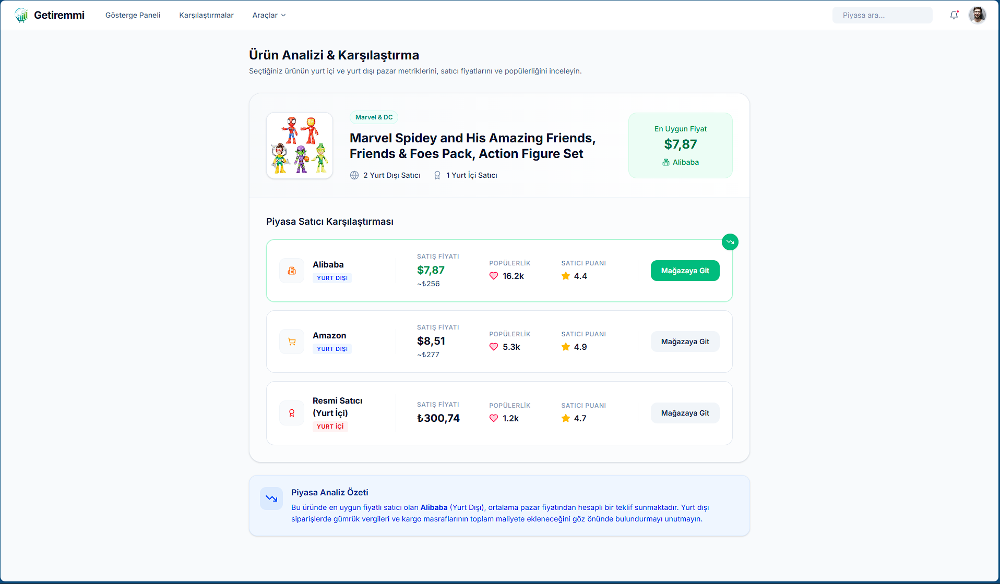
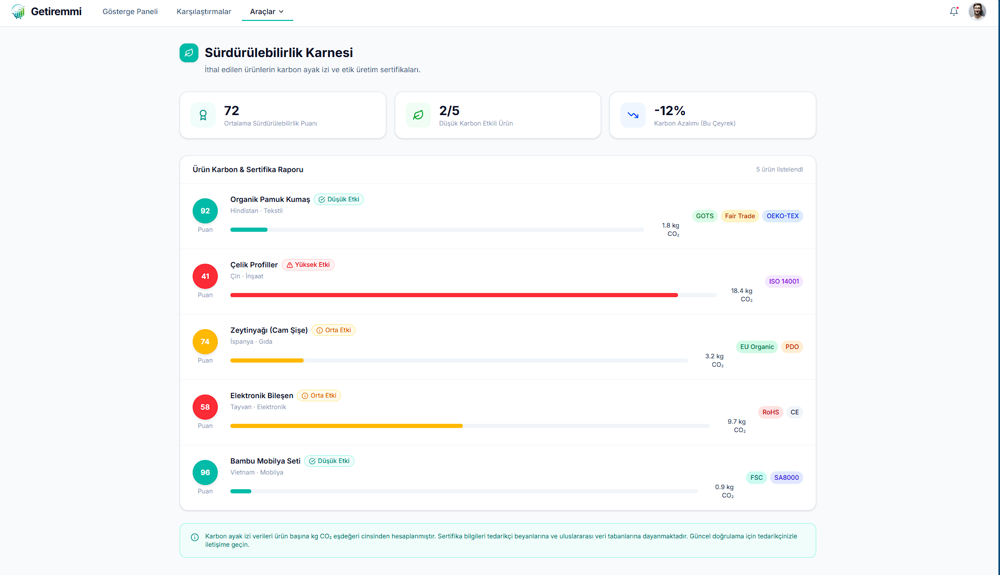
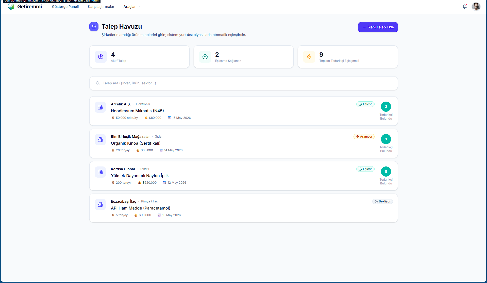
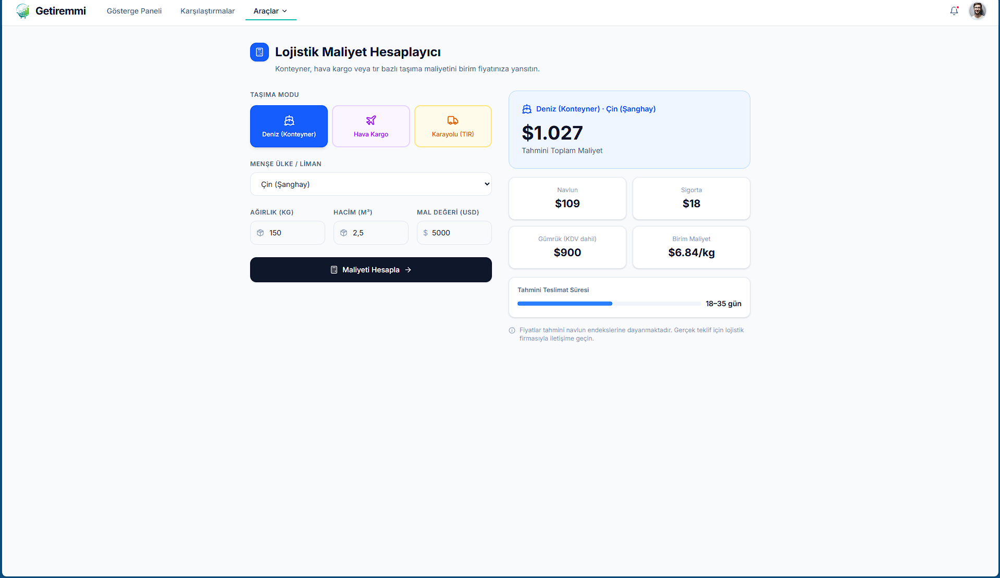
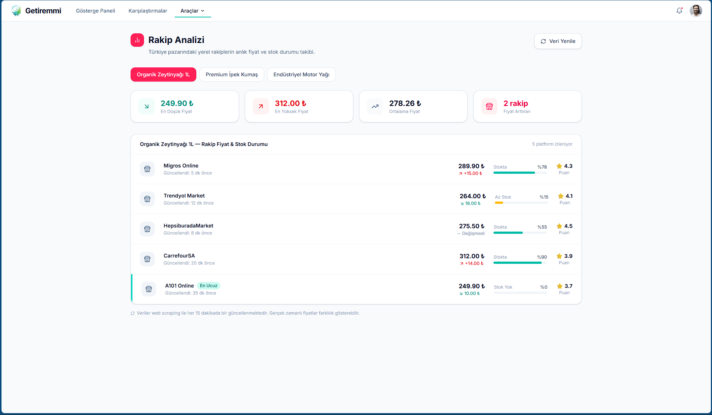
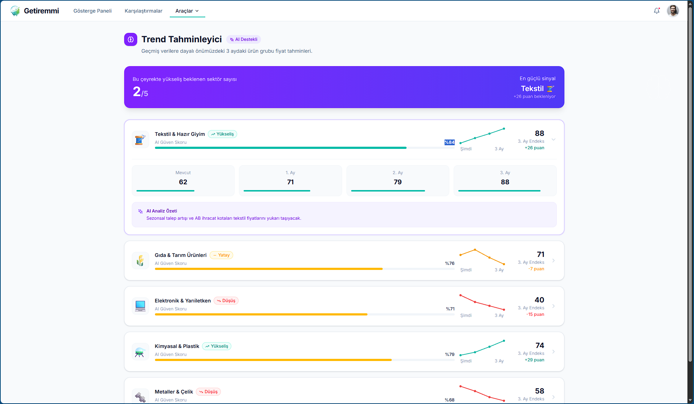

# 🚀 Getiremmi Frontend

Bu proje, **Getiremmi** uygulamasının kullanıcı arayüzünü (frontend) içerir. Modern web teknolojileri kullanılarak, **B2B ticaret, e-ihracat analizleri ve araçları** sunmak üzere geliştirilmiştir.

---

## 📋 İçindekiler
- [📂 Proje Kaynakları (Google Drive)](#-proje-kaynakları-google-drive)
- [Teknolojiler (Tech Stack)](#-teknolojiler-tech-stack)
- [Mimari ve Proje Yapısı](#️-mimari-ve-proje-yapısı)
- [Modüller ve Teknik Mimari](#-modüller-ve-teknik-mimari)
- [Kurulum ve Çalıştırma](#-kurulum-ve-çalıştırma)
- [Ek Notlar](#-ek-notlar)

---

## 📂 Proje Kaynakları (Google Drive)

Projenin tasarım kaynaklarına, dokümantasyonlarına ve paylaşılan diğer kurumsal materyallere aşağıdaki bağlantıdan ulaşabilirsiniz:

🔗 **[Getiremmi Google Drive Klasörü](https://drive.google.com/file/d/1WDb40VfZ4rCByJzQcrxeC_VpGNdq10GG/view?usp=sharing)**

---

## 🛠️ Teknolojiler (Tech Stack)

| Teknoloji | Araç / Kütüphane |
| :--- | :--- |
| **Framework** | [React 18](https://react.dev/) |
| **Build Aracı** | [Vite](https://vitejs.dev/) |
| **Dil** | [TypeScript](https://www.typescriptlang.org/) |
| **Stilleme** | [Tailwind CSS](https://tailwindcss.com/) |
| **İkonlar** | [Lucide React](https://lucide.dev/) |
| **Backend / DB** | Firebase (& Supabase) |

---

## 🖼️ Ekran Görüntüleri

| | | |
| :---: | :---: | :---: |
|  |  |  |
|  |  |  |
|  |  |  |

---

## 🏗️ Mimari ve Proje Yapısı

Proje, **Single Page Application (SPA)** mimarisiyle kurgulanmış olup modüler bir sayfa (page) ve bileşen (component) yapısına sahiptir. Yönlendirme (routing), harici bir kütüphane yerine şimdilik `App.tsx` içindeki state (`activePage`) ile yönetilmektedir.

### 📂 Klasör Yapısı

```text
frontend/
├── assets/             # Görseller, logolar ve diğer statik dosyalar
├── public/             # Halka açık statik varlıklar (favicon vb.)
└── src/
    ├── components/     # Yeniden kullanılabilir UI bileşenleri
    │   ├── Chart.tsx
    │   ├── DashboardCard.tsx
    │   ├── Header.tsx
    │   └── Sidebar.tsx
    ├── pages/          # Uygulamanın ana sayfaları ve modülleri
    │   ├── ComparisonsPage.tsx
    │   ├── CustomsPage.tsx
    │   ├── DashboardPage.tsx
    │   ├── LogisticsPage.tsx
    │   ├── TrendPage.tsx
    │   └── ...         # Diğer modüller (Sustainability, Markets, vb.)
    ├── App.tsx         # Ana uygulama bileşeni ve routing mantığı
    ├── firebase.ts     # Firebase konfigürasyon ve bağlantı ayarları
    ├── index.css       # Global Tailwind CSS stilleri
    └── main.tsx        # Uygulamanın giriş noktası
```

## 🧩 Modüller ve Teknik Mimari

Proje, Amazon UK/Global verilerini işleyerek lojistik ve ticari içgörülere dönüştüren modüler bir **"Akıllı Kontrol Noktası" (Smart Control Point)** mimarisine sahiptir.

### 📊 1. Akıllı Kıyaslama Modülü
> E-ticaret yöneticilerinin veri kirliliği içinde kaybolmasını engellemek için farklı platformlardan gelen karmaşık fiyat, stok ve rekabet verilerini tek bir merkezde standartlaştırır. Kullanıcının sadece "en ucuz" olana değil, "en kârlı ve sürdürülebilir" olana odaklanmasını sağlar.

* **Fonksiyon:** 24+ farklı ürünü fiyat, stok ve AI puanı üzerinden eş zamanlı kıyaslar.
* **İşleyiş:** Seçilen ürünleri React state'inde birleştirir; veritabanından çekilen JSON verilerini dinamik bir tabloda eşleştirir.
* **Teknoloji:** React tablo bileşenleri ve **TypeScript** tip tanımlamaları.

### 📈 2. Trend ve Tahminleme Modülü (`TrendPage.tsx`)
> Geçmiş pazar verilerini ve anlık Amazon UK verilerini analiz ederek, gelecek 3 aylık süreçte ürünlerin fiyat dalgalanmalarını, talep trendlerini ve sektörel fırsatları otonom olarak tahmin eder.

* **Fonksiyon:** Gelecek 3 aylık fiyat yönünü ve talep artış/azalış trendlerini öngörür.
* **İşleyiş:** Python backend'deki `trend_predictor.py` modülü SQLite verisini işler; AI tahminlerini JSON formatında API üzerinden frontend'e aktarır.
* **Teknoloji:** **Chart.js** veya **Recharts** kütüphaneleri ile entegre otonom AI çıktıları.

### 🎛️ 3. Akıllı Kontrol Paneli (Dashboard)
> `core_scrapper` ve `ai_advisor` modülleri tarafından işlenen ham veriyi, ticari aksiyon planlarına dönüştüren ana yönetim arayüzüdür.

* **Veri Görselleştirme:** Otonom çekilen Amazon verilerini **React** ve **Lucide-React** bileşenleri ile dinamik grafiklere dönüştürür.
* **AI Tabanlı Analitik:** Her bir ürün kartı, **Gemini 1.5 Flash** modeli tarafından analiz edilerek kârlılık potansiyeli ve piyasa riskine göre filtrelenir.
* **Modüler Entegrasyon:** **FastAPI** endpoint'leri üzerinden SQLite ile haberleşir. Bileşen bazlı yapısı sayesinde *Sustainability*, *Demand Pool* veya *Gümrük Mevzuatı* gibi modüller sisteme hızla entegre edilebilir.

### 🚛 4. Navlun ve Rota Optimizasyonu (`LogisticsPage`)
> Lojistik süreçlerin en karmaşık kısmı olan navlun maliyeti hesaplama ve rota verimliliği analizini üstlenir.

* **Fonksiyon:** Ürün parametrelerini (ağırlık, boyut, varış noktası) işleyerek kargo maliyetlerini, gümrük vergisi tahminlerini ve lojistik riskleri saniyeler içinde hesaplar.
* **İşleyiş:** `LojistikFormu.tsx` üzerinden alınan veriler **Axios** ile backend'e iletilir. `ai_advisor` (Gemini 1.5 Flash) piyasa eğilimlerini analiz ederek "Maliyet Etkin Rota" önerisi sunar.
* **Teknoloji:** Vite & React (Frontend), Python & FastAPI (Backend), Gemini API (Zeka), Pasta Grafiği (Maliyet Dağılımı Görselleştirmesi).

### ⚖️ 5. Gümrük Mevzuat ve GTIP Kütüphanesi (`CustomsPage`)
> Uluslararası ticaretteki en büyük bariyer olan gümrükleme süreçlerini dijitalleştirerek yasal riskleri minimize eder.

* **Fonksiyon:** Ürünlerin GTIP (Gümrük Tarife İstatistik Pozisyonu) kodlarını tanımlar, ülkelerin vergi oranlarını (KDV, Gümrük Vergisi vb.) hesaplar ve ithalat/ihracat kısıtlamalarını denetler.
* **İşleyiş:** Kullanıcı ürün adını veya GTIP kodunu girdiğinde, FastAPI gümrük servisi `ai_advisor` modülünü tetikler. Karmaşık mevzuat metinleri analiz edilerek kullanıcıya anlık yasal uyarılar (örn: elektronik kısıtlaması) aktarılır.
* **Teknoloji:** React tabanlı hızlı arama arayüzü, Python mevzuat veri setleri, optimize edilmiş güncel GTIP veritabanı ve Gemini API.

---

## 💻 Kurulum ve Çalıştırma

Projeyi yerel ortamınızda çalıştırmak için aşağıdaki adımları izleyin:

**1. Bağımlılıkları yükleyin:**
```bash
npm install
```

**2. Geliştirme sunucusunu başlatın:**
```bash
npm run dev
```
> *Not: Uygulama varsayılan olarak Vite'in belirlediği portta (genellikle `http://localhost:5173`) çalışacaktır.*

**3. Projeyi canlı (production) ortamı için derlemek isterseniz:**
```bash
npm run build
```

---

## 📝 Ek Notlar

- **ESLint ve PostCSS:** Entegrasyonları proje genelinde aktiftir (`eslint.config.js`, `postcss.config.js`).
- **Tailwind CSS:** Yapılandırması Vite ve PostCSS ile entegre bir şekilde çalışmaktadır.
# 🚀 Getiremmi Frontend

Bu proje, **Getiremmi** uygulamasının kullanıcı arayüzünü (frontend) içerir. Modern web teknolojileri kullanılarak, **B2B ticaret, e-ihracat analizleri ve araçları** sunmak üzere geliştirilmiştir.

---

## 📋 İçindekiler
- [📂 Proje Kaynakları (Google Drive)](#-proje-kaynakları-google-drive)
- [Teknolojiler (Tech Stack)](#-teknolojiler-tech-stack)
- [Mimari ve Proje Yapısı](#️-mimari-ve-proje-yapısı)
- [Modüller ve Teknik Mimari](#-modüller-ve-teknik-mimari)
- [Kurulum ve Çalıştırma](#-kurulum-ve-çalıştırma)
- [Ek Notlar](#-ek-notlar)

---

## 📂 Proje Kaynakları (Google Drive)

Projenin tasarım kaynaklarına, dokümantasyonlarına ve paylaşılan diğer kurumsal materyallere aşağıdaki bağlantıdan ulaşabilirsiniz:

🔗 **[Getiremmi Google Drive Klasörü]([Proje Videosu](https://drive.google.com/file/d/1WDb40VfZ4rCByJzQcrxeC_VpGNdq10GG/view?usp=sharing))**

---

## 🛠️ Teknolojiler (Tech Stack)

| Teknoloji | Araç / Kütüphane |
| :--- | :--- |
| **Framework** | [React 18](https://react.dev/) |
| **Build Aracı** | [Vite](https://vitejs.dev/) |
| **Dil** | [TypeScript](https://www.typescriptlang.org/) |
| **Stilleme** | [Tailwind CSS](https://tailwindcss.com/) |
| **İkonlar** | [Lucide React](https://lucide.dev/) |
| **Backend / DB** | Firebase (& Supabase) |

---

## 🖼️ Ekran Görüntüleri

| | | |
| :---: | :---: | :---: |
|  |  |  |
|  |  |  |
|  |  |  |

---

## 🏗️ Mimari ve Proje Yapısı

Proje, **Single Page Application (SPA)** mimarisiyle kurgulanmış olup modüler bir sayfa (page) ve bileşen (component) yapısına sahiptir. Yönlendirme (routing), harici bir kütüphane yerine şimdilik `App.tsx` içindeki state (`activePage`) ile yönetilmektedir.

### 📂 Klasör Yapısı

```text
frontend/
├── assets/             # Görseller, logolar ve diğer statik dosyalar
├── public/             # Halka açık statik varlıklar (favicon vb.)
└── src/
    ├── components/     # Yeniden kullanılabilir UI bileşenleri
    │   ├── Chart.tsx
    │   ├── DashboardCard.tsx
    │   ├── Header.tsx
    │   └── Sidebar.tsx
    ├── pages/          # Uygulamanın ana sayfaları ve modülleri
    │   ├── ComparisonsPage.tsx
    │   ├── CustomsPage.tsx
    │   ├── DashboardPage.tsx
    │   ├── LogisticsPage.tsx
    │   ├── TrendPage.tsx
    │   └── ...         # Diğer modüller (Sustainability, Markets, vb.)
    ├── App.tsx         # Ana uygulama bileşeni ve routing mantığı
    ├── firebase.ts     # Firebase konfigürasyon ve bağlantı ayarları
    ├── index.css       # Global Tailwind CSS stilleri
    └── main.tsx        # Uygulamanın giriş noktası
```

## 🧩 Modüller ve Teknik Mimari

Proje, Amazon UK/Global verilerini işleyerek lojistik ve ticari içgörülere dönüştüren modüler bir **"Akıllı Kontrol Noktası" (Smart Control Point)** mimarisine sahiptir.

### 📊 1. Akıllı Kıyaslama Modülü
> E-ticaret yöneticilerinin veri kirliliği içinde kaybolmasını engellemek için farklı platformlardan gelen karmaşık fiyat, stok ve rekabet verilerini tek bir merkezde standartlaştırır. Kullanıcının sadece "en ucuz" olana değil, "en kârlı ve sürdürülebilir" olana odaklanmasını sağlar.

* **Fonksiyon:** 24+ farklı ürünü fiyat, stok ve AI puanı üzerinden eş zamanlı kıyaslar.
* **İşleyiş:** Seçilen ürünleri React state'inde birleştirir; veritabanından çekilen JSON verilerini dinamik bir tabloda eşleştirir.
* **Teknoloji:** React tablo bileşenleri ve **TypeScript** tip tanımlamaları.

### 📈 2. Trend ve Tahminleme Modülü (`TrendPage.tsx`)
> Geçmiş pazar verilerini ve anlık Amazon UK verilerini analiz ederek, gelecek 3 aylık süreçte ürünlerin fiyat dalgalanmalarını, talep trendlerini ve sektörel fırsatları otonom olarak tahmin eder.

* **Fonksiyon:** Gelecek 3 aylık fiyat yönünü ve talep artış/azalış trendlerini öngörür.
* **İşleyiş:** Python backend'deki `trend_predictor.py` modülü SQLite verisini işler; AI tahminlerini JSON formatında API üzerinden frontend'e aktarır.
* **Teknoloji:** **Chart.js** veya **Recharts** kütüphaneleri ile entegre otonom AI çıktıları.

### 🎛️ 3. Akıllı Kontrol Paneli (Dashboard)
> `core_scrapper` ve `ai_advisor` modülleri tarafından işlenen ham veriyi, ticari aksiyon planlarına dönüştüren ana yönetim arayüzüdür.

* **Veri Görselleştirme:** Otonom çekilen Amazon verilerini **React** ve **Lucide-React** bileşenleri ile dinamik grafiklere dönüştürür.
* **AI Tabanlı Analitik:** Her bir ürün kartı, **Gemini 1.5 Flash** modeli tarafından analiz edilerek kârlılık potansiyeli ve piyasa riskine göre filtrelenir.
* **Modüler Entegrasyon:** **FastAPI** endpoint'leri üzerinden SQLite ile haberleşir. Bileşen bazlı yapısı sayesinde *Sustainability*, *Demand Pool* veya *Gümrük Mevzuatı* gibi modüller sisteme hızla entegre edilebilir.

### 🚛 4. Navlun ve Rota Optimizasyonu (`LogisticsPage`)
> Lojistik süreçlerin en karmaşık kısmı olan navlun maliyeti hesaplama ve rota verimliliği analizini üstlenir.

* **Fonksiyon:** Ürün parametrelerini (ağırlık, boyut, varış noktası) işleyerek kargo maliyetlerini, gümrük vergisi tahminlerini ve lojistik riskleri saniyeler içinde hesaplar.
* **İşleyiş:** `LojistikFormu.tsx` üzerinden alınan veriler **Axios** ile backend'e iletilir. `ai_advisor` (Gemini 1.5 Flash) piyasa eğilimlerini analiz ederek "Maliyet Etkin Rota" önerisi sunar.
* **Teknoloji:** Vite & React (Frontend), Python & FastAPI (Backend), Gemini API (Zeka), Pasta Grafiği (Maliyet Dağılımı Görselleştirmesi).

### ⚖️ 5. Gümrük Mevzuat ve GTIP Kütüphanesi (`CustomsPage`)
> Uluslararası ticaretteki en büyük bariyer olan gümrükleme süreçlerini dijitalleştirerek yasal riskleri minimize eder.

* **Fonksiyon:** Ürünlerin GTIP (Gümrük Tarife İstatistik Pozisyonu) kodlarını tanımlar, ülkelerin vergi oranlarını (KDV, Gümrük Vergisi vb.) hesaplar ve ithalat/ihracat kısıtlamalarını denetler.
* **İşleyiş:** Kullanıcı ürün adını veya GTIP kodunu girdiğinde, FastAPI gümrük servisi `ai_advisor` modülünü tetikler. Karmaşık mevzuat metinleri analiz edilerek kullanıcıya anlık yasal uyarılar (örn: elektronik kısıtlaması) aktarılır.
* **Teknoloji:** React tabanlı hızlı arama arayüzü, Python mevzuat veri setleri, optimize edilmiş güncel GTIP veritabanı ve Gemini API.

---

## 💻 Kurulum ve Çalıştırma

Projeyi yerel ortamınızda çalıştırmak için aşağıdaki adımları izleyin:

**1. Bağımlılıkları yükleyin:**
```bash
npm install
```

**2. Geliştirme sunucusunu başlatın:**
```bash
npm run dev
```
> *Not: Uygulama varsayılan olarak Vite'in belirlediği portta (genellikle `http://localhost:5173`) çalışacaktır.*

**3. Projeyi canlı (production) ortamı için derlemek isterseniz:**
```bash
npm run build
```

---

## 📝 Ek Notlar

- **ESLint ve PostCSS:** Entegrasyonları proje genelinde aktiftir (`eslint.config.js`, `postcss.config.js`).
- **Tailwind CSS:** Yapılandırması Vite ve PostCSS ile entegre bir şekilde çalışmaktadır.
