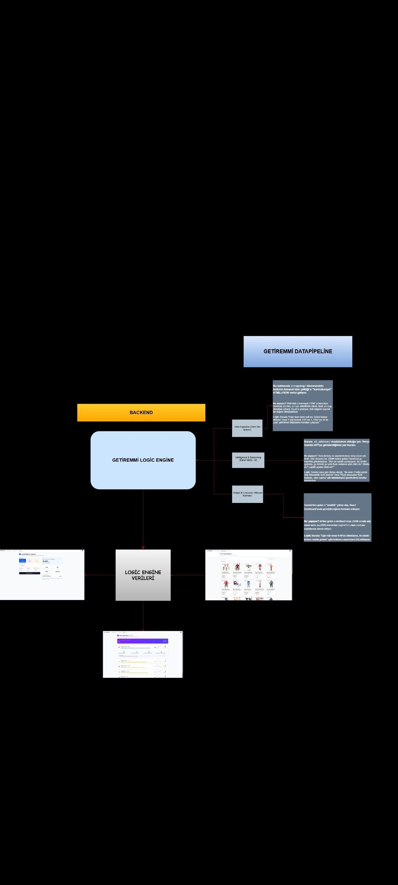
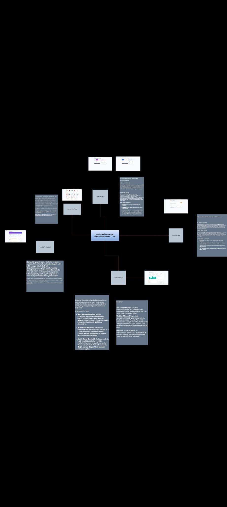

# Getiremmi

BTK Hackathon Yarışması için geliştirilen bu platform, e-ticaret lojistik süreçlerini optimize eden otonom bir **Karar Destek ve Veri Analitiği** sistemidir. Uygulama; web scraping ile Amazon UK/Global kaynaklarından toplanan ham veriyi yapay zeka ile işleyerek, kullanıcıya ürün fiyat analizi, stok takibi ve karlılık tahminleri sunar.

Platform, tüm bu veriyi sezgisel bir React dashboard üzerinde görselleştirerek lojistik karar alma süreçlerini kolaylaştırır.

---

### ⚙️ Backend Mimarisi (Data Engine)
Backend katmanımız, veriyi sadece depolamaz; `Gemini 1.5 Flash` entegrasyonu ile veriyi anlamlandırarak stratejik içgörüye dönüştürür.



### 🖥️ Frontend Mimarisi (Decision Support)
Frontend katmanımız, backend'den gelen veriyi modüler bileşenler (React/TS) ile görselleştirir. Her modül, lojistik ve ticaret kararlarını desteklemek için özel olarak optimize edilmiştir.


### 🎥 Uygulama Tanıtım Videosu
[▶️ Google Drive Tanıtım Videosu](https://drive.google.com/file/d/1WDb40VfZ4rCByJzQcrxeC_VpGNdq10GG/view?usp=sharing)

---

## 📊 Uygulama Özellikleri

* **Gösterge Paneli (Dashboard):** Gerçek zamanlı ticaret piyasası analitikleri, hacim ve trend takibi.
* **Ürün Karşılaştırması:** 24+ ürün üzerinde kategori, stok ve müşteri puanı analizi.
* **Sürdürülebilirlik Analizi:** Karbon ayak izi hesaplaması ve sertifika (GOTS, Fair Trade vb.) kontrolü.
* **Talep Havuzu:** Yurt dışı piyasalarla otomatik eşleştirme ve tedarikçi takibi.
* **Gümrük Mevzuat Kütüphanesi:** GTIP kodu araması, vergi ve KDV hesaplaması.
* **Rakip Analizi:** Yerel rakiplerin fiyat/stok takibi ve platform karşılaştırması.
* **Trend Tahmini (AI Desteği):** Geçmiş verilere dayalı 3 aylık fiyat yönü ve sektör tahmini.
* **Ürün Analizi:** Çok platformlu detaylı karşılaştırma ve piyasa analiz özeti.

---

## 🛠️ Kullanılan Teknolojiler

| Katman | Teknoloji |
| :--- | :--- |
| **Frontend** | React, Vite, TypeScript |
| **UI Bileşenleri** | Lucide-React |
| **Backend (API)** | Python 3.10, FastAPI, Uvicorn |
| **AI / LLM** | Google Gemini API (1.5 Flash) |
| **Veri Hattı** | BeautifulSoup4, Requests, Selenium |
| **Veri Analizi** | NumPy |
| **Veritabanı** | SQLite |

---

## 📂 Proje Dosya Yapısı

```text
/backend
├── scrapping/         # Amazon UK veri çekme botları
├── data_processor/    # Veri temizleme ve normalizasyon
├── ai_advisor/        # Gemini API karar destek motoru
└── main.py            # FastAPI ana giriş noktası

/frontend
├── src/               # React kaynak kodları
│   └── pages/         # Sayfa bileşenleri
└── package.json

🔄 Veri Akışı (Data Pipeline)

graph LR
    A[Source: Amazon UK] --> B[Process: Scrapping]
    B --> C[Store: SQLite]
    C --> D[Analyze: Gemini API]
    D --> E[Display: React Dashboard]

🚀 Kurulum ve Çalıştırma
Backend
cd backend
pip install -r requirements.txt
uvicorn main:app --reload --port 8000

Frontend
cd frontend
npm install
npm run dev

Not: Backend http://localhost:8000 portunda, Frontend http://localhost:5173 portunda çalışır.

Ortam Değişkenleri
.env.example dosyasını kopyalayarak kendi .env dosyanızı oluşturun ve gerekli API anahtarlarını ekleyin:

cp .env.example .env
